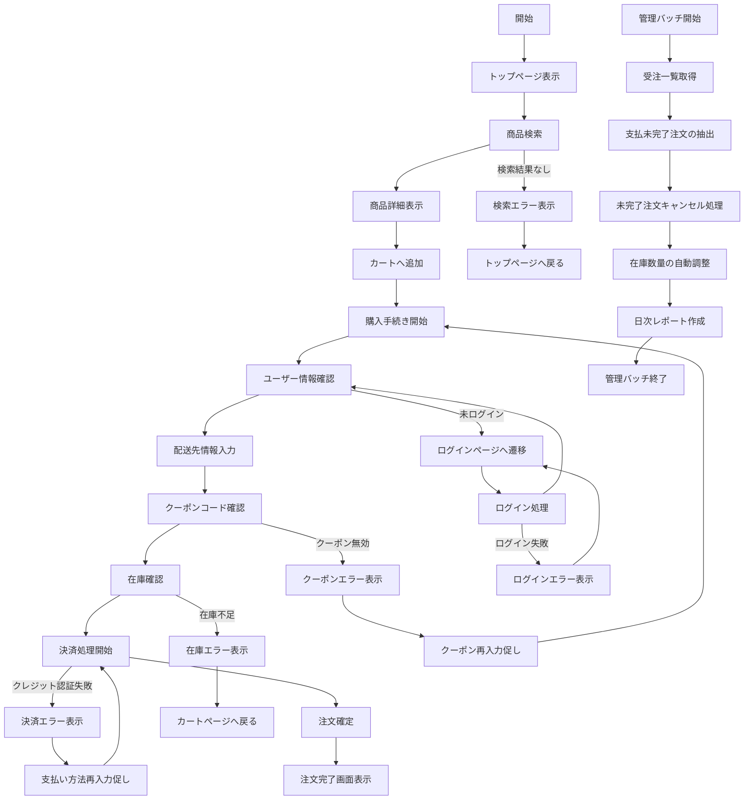

```mermaid
flowchart TD
    n0["開始"]
    n1["トップページ表示"]
    n2["商品検索"]
    n3["検索エラー表示"]
    n4["商品詳細表示"]
    n5["カートへ追加"]
    n6["購入手続き開始"]
    n7["ユーザー情報確認"]
    n8["ログインページへ遷移"]
    n9["配送先情報入力"]
    n10["クーポンコード確認"]
    n11["クーポンエラー表示"]
    n12["在庫確認"]
    n13["在庫エラー表示"]
    n14["決済処理開始"]
    n15["決済エラー表示"]
    n16["注文確定"]
    n17["注文完了画面表示"]
    n18["トップページへ戻る"]
    n19["クーポン再入力促し"]
    n20["カートページへ戻る"]
    n21["支払い方法再入力促し"]
    n22["ログイン処理"]
    n23["ログインエラー表示"]
    n24["管理バッチ開始"]
    n25["受注一覧取得"]
    n26["支払未完了注文の抽出"]
    n27["未完了注文キャンセル処理"]
    n28["在庫数量の自動調整"]
    n29["日次レポート作成"]
    n30["管理バッチ終了"]
    n0 --> n1
    n1 --> n2
    n2 -->|検索結果なし| n3
    n2 --> n4
    n4 --> n5
    n5 --> n6
    n6 --> n7
    n7 -->|未ログイン| n8
    n7 --> n9
    n9 --> n10
    n10 -->|クーポン無効| n11
    n10 --> n12
    n12 -->|在庫不足| n13
    n12 --> n14
    n14 -->|クレジット認証失敗| n15
    n14 --> n16
    n16 --> n17
    n3 --> n18
    n11 --> n19
    n19 --> n6
    n13 --> n20
    n15 --> n21
    n21 --> n14
    n8 --> n22
    n22 -->|ログイン失敗| n23
    n22 --> n7
    n23 --> n8
    n24 --> n25
    n25 --> n26
    n26 --> n27
    n27 --> n28
    n28 --> n29
    n29 --> n30
```