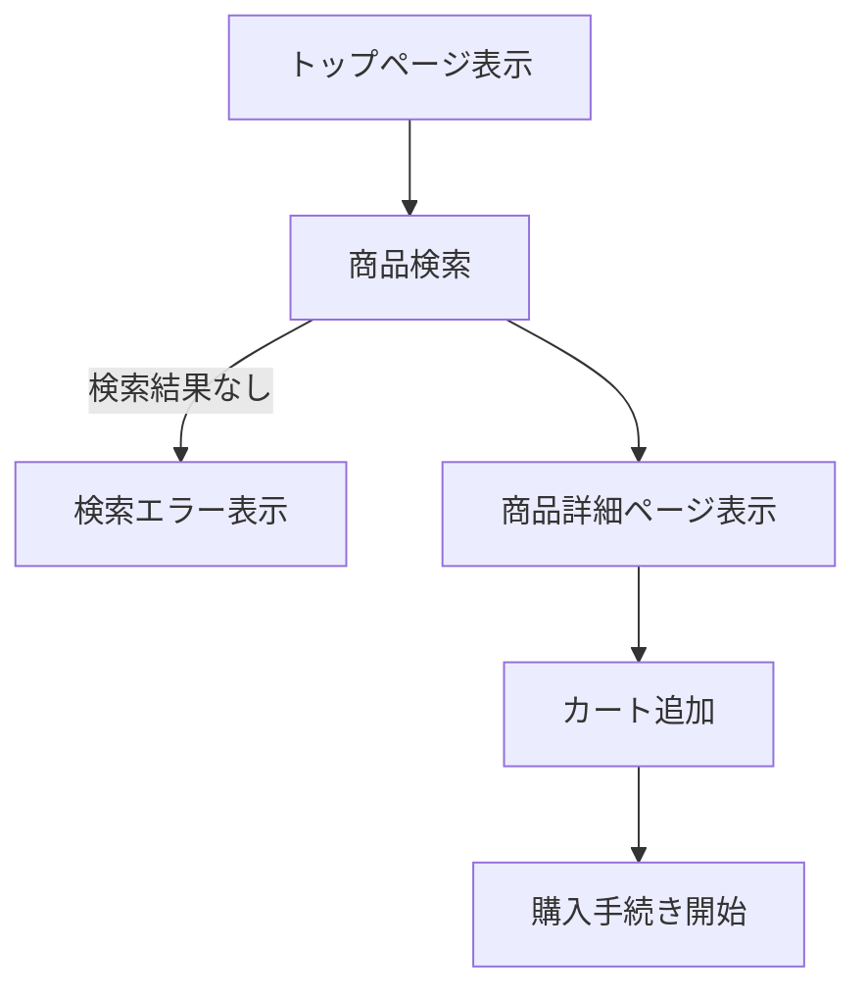
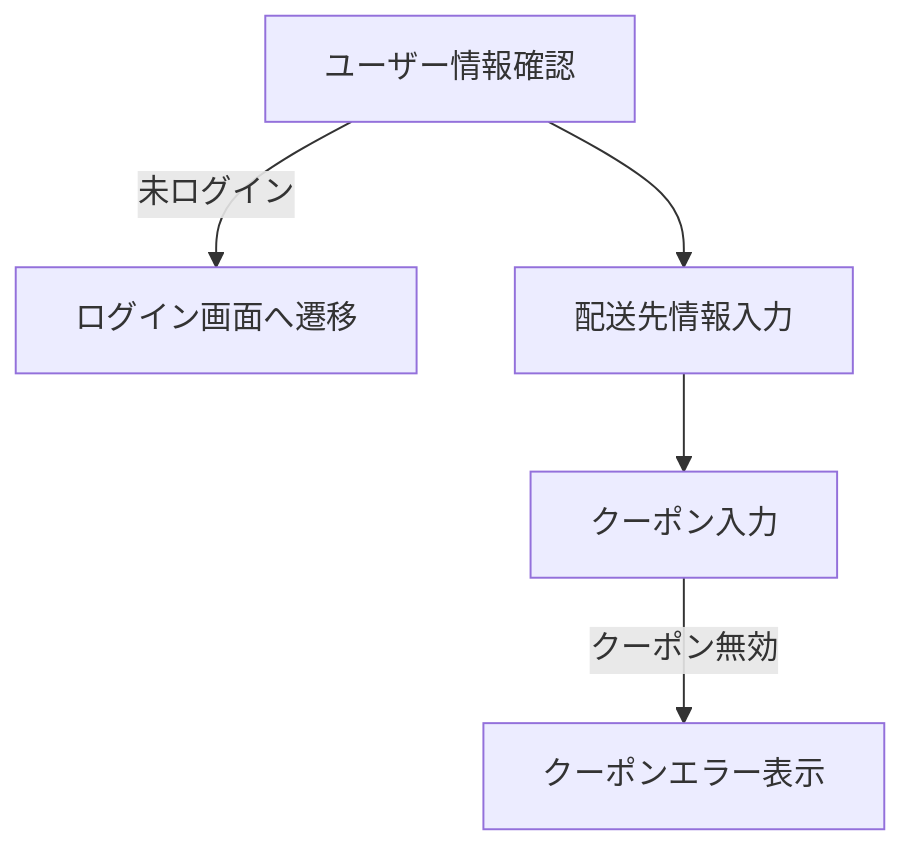
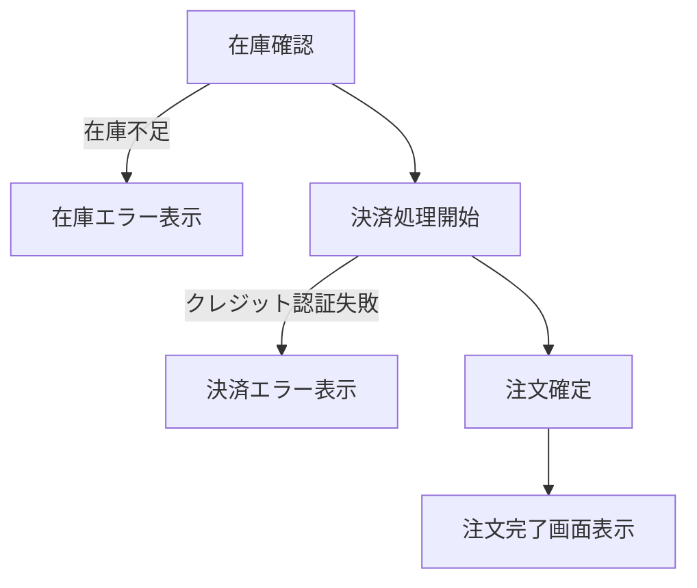
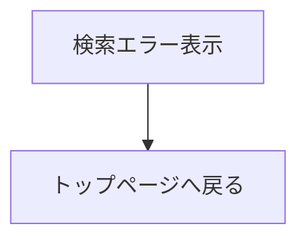
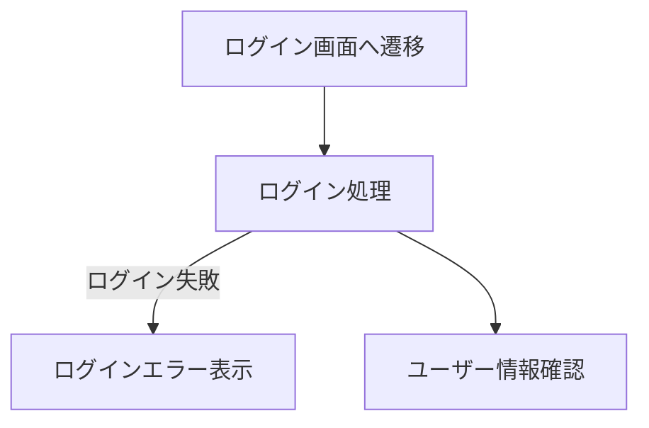
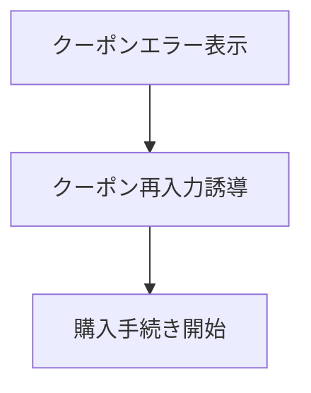
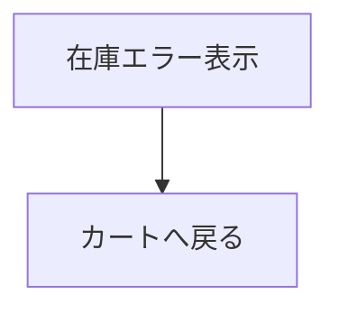
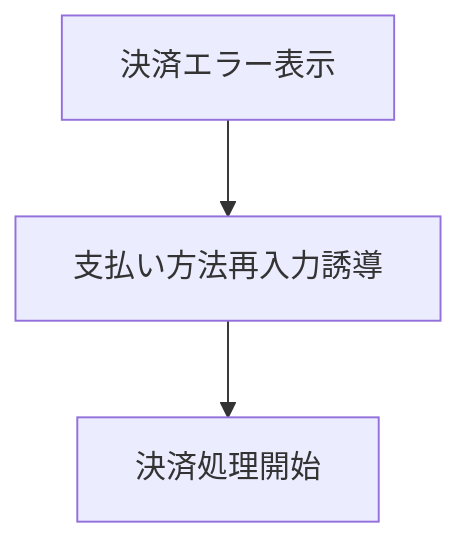
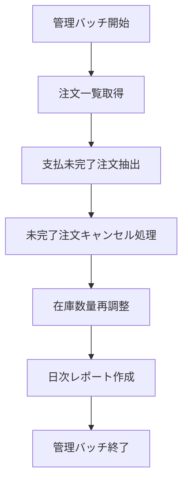

# ECショップ基本フロー
ユーザーが商品を購入して注文が確定するまでの一般的な流れを示します。
以下のブロックは、購入フローの概要説明です。

## ユーザー情報と配送情報
次にユーザー情報や配送先情報などを確認するステップです。
ログインしていない場合はログインに誘導します。

## 在庫確認と決済処理
注文処理における中核部分です。
在庫不足や決済エラーが発生した場合の分岐も含まれます。

## エラー処理系 1：検索エラー
検索時に商品が見つからなかった場合の処理です。

## エラー処理系 2：ログインエラー
ログイン失敗時のハンドリングです。

## エラー処理系 3：クーポンエラー
クーポンが無効だった場合の処理です。

## エラー処理系 4：在庫エラー
在庫不足時の処理で、ユーザーをカートへ戻します。

## エラー処理系 5：決済エラー
決済に失敗した場合のリカバリフローです。

## 管理用バッチ処理
ここからはシステム管理側の夜間バッチなどを想定した処理です。

